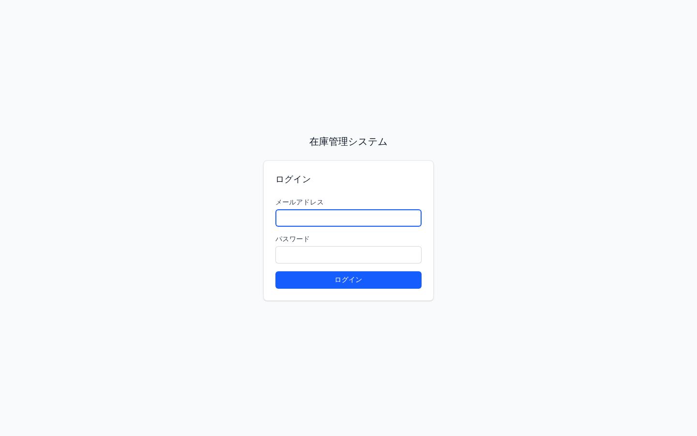
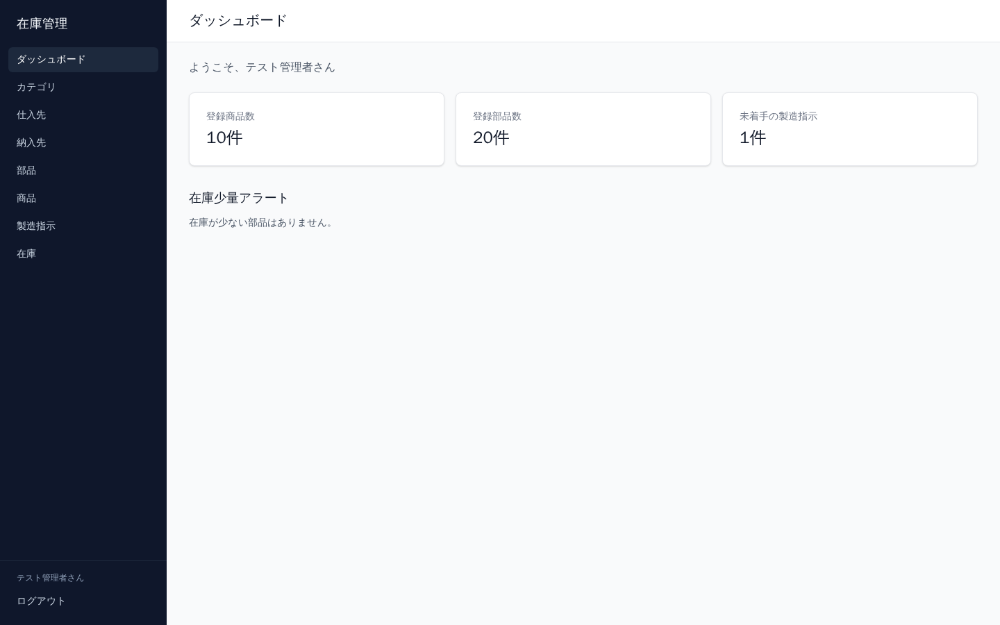
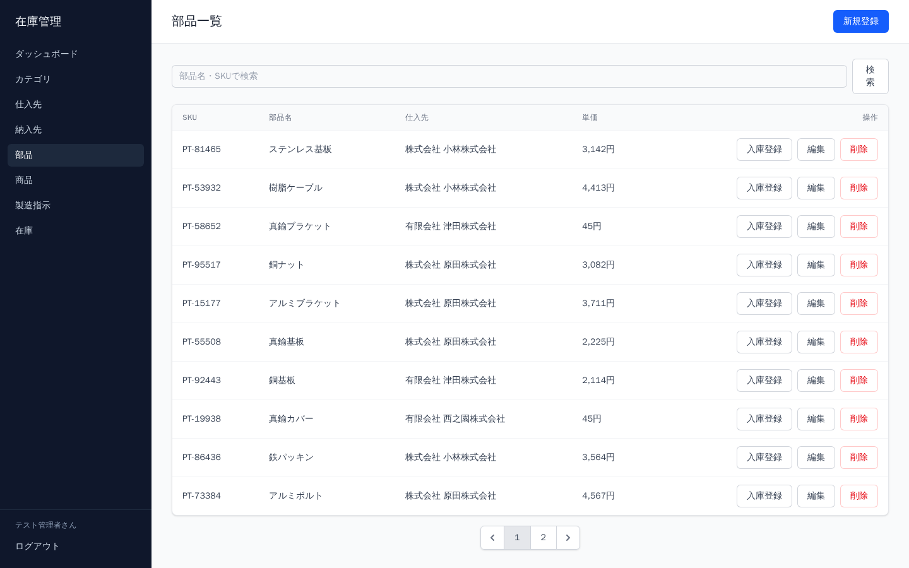
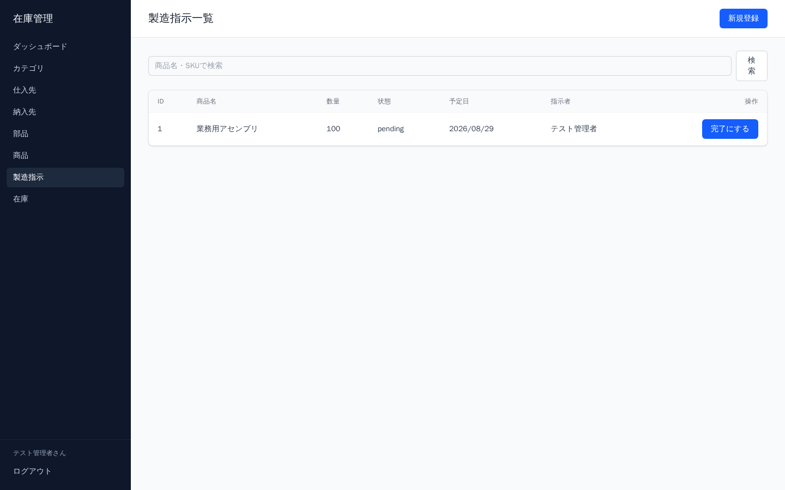
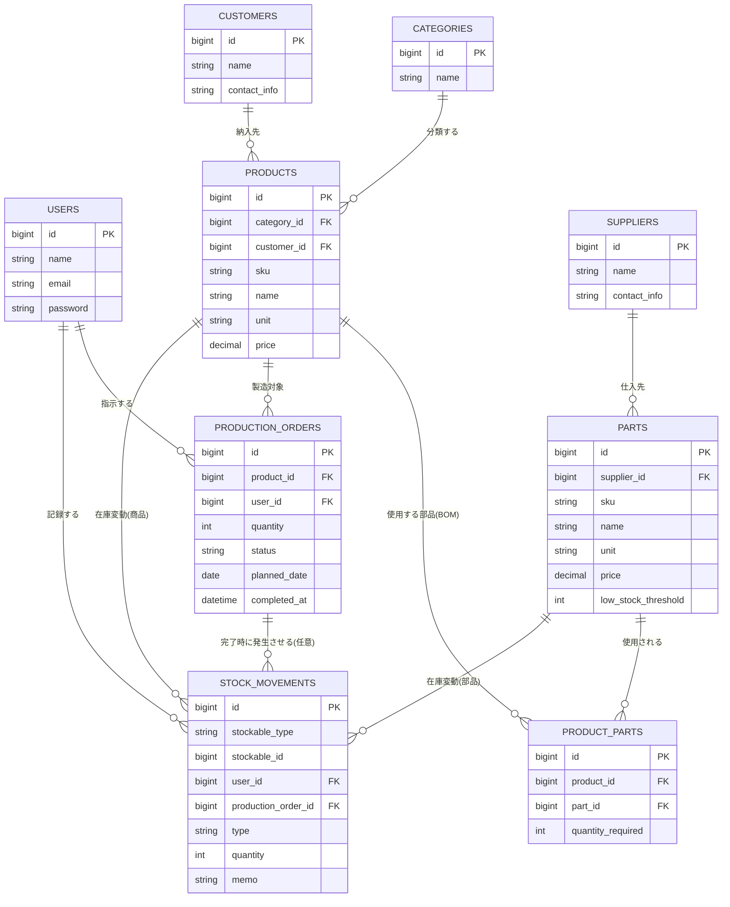

# 在庫管理システム (Manufacturing Inventory Management System)


製造業向けの在庫管理システムです。前職で製造業の経験をもとに、「仕入先からの部品調達 → 製造指示による部品消費・商品生産 → 納入先への出荷」という一連の業務フローを1つのアプリで管理できるように設計・実装しました。

## スクリーンショット

| ログイン画面                                | ダッシュボード                                    |
| ------------------------------------------- | ------------------------------------------------- |
|  |  |

| 部品一覧画面                            | 製造指示一覧画面                                        |
| --------------------------------------- | ------------------------------------------------------- |
|  |  |

## 機能一覧

- ユーザー認証（Laravel Fortify: ログイン・パスワードリセット・2要素認証・パスキー対応）
    - ※ 業務データへの不用意なアクセスを避けるため、公開の新規登録は無効化しており、管理者アカウントはシーダーで作成する運用としています
- ダッシュボード（登録商品数・部品数・未着手の製造指示数のサマリー表示、部品ごとに設定できる低在庫アラート）
- カテゴリ管理（CRUD・キーワード検索）
- 仕入先管理（CRUD・キーワード検索・取引部品一覧）
- 納入先管理（CRUD・キーワード検索・取引商品一覧）
- 部品管理（CRUD・SKU/名称検索・手動入庫登録・低在庫アラート閾値の個別設定）
- 商品管理（CRUD・SKU/名称検索・部品表(BOM)管理）
- 製造指示（登録・検索、完了処理で必要部品の自動出庫と商品の自動入庫を実行。在庫不足時はDBトランザクションごとロールバック）
- 在庫一覧（商品・部品の現在庫数表示）
- 在庫変動履歴（入出庫ログの一覧）

本プロジェクトは Laravel Sail（Docker）上で動作します。

## 環境構築

```bash
git clone https://github.com/kazuyuki-a-dev/inventory-system.git
cd inventory-system
cp .env.example .env
```

`.env` のDB接続情報を、Sailが起動するMySQLコンテナに合わせて書き換えます。

```
DB_CONNECTION=mysql
DB_HOST=mysql
DB_PORT=3306
DB_DATABASE=laravel
DB_USERNAME=sail
DB_PASSWORD=password
```

`vendor/bin/sail` はcomposerの依存関係としてインストールされるためリポジトリには含まれていません。初回のみ、composerイメージを使って依存関係をインストールします。

```bash
docker run --rm \
    -u "$(id -u):$(id -g)" \
    -v "$(pwd):/var/www/html" \
    -w /var/www/html \
    laravelsail/php84-composer:latest \
    composer install --ignore-platform-reqs

./vendor/bin/sail up -d
./vendor/bin/sail artisan key:generate
```

MySQLコンテナの起動完了までに時間がかかることがあります。数秒待ってから下記のコマンドを実行してください。

```bash
./vendor/bin/sail artisan migrate --seed
```

フロントエンド（Tailwind CSS）のビルドが必要な場合は以下も実行してください。

```bash
./vendor/bin/sail npm install
./vendor/bin/sail npm run build
```

## 👤 テスト用ログインアカウント

環境構築後、`DatabaseSeeder` で作成される以下のアカウントでログインできます。

| 項目           | 設定値            |
| -------------- | ----------------- |
| メールアドレス | admin@example.com |
| パスワード     | password          |

※ 公開の新規登録機能は無効化しているため、追加のユーザーが必要な場合は `sail artisan tinker` 等で作成してください。

## テストの実行と品質担保

本プロジェクトでは、PHPUnit を用いたFeatureテストを整備し、全 **48項目** のテストを通過しています。

```bash
./vendor/bin/sail artisan test
```

主なテスト対象:

- 各リソース（カテゴリ・仕入先・納入先・部品・商品・製造指示）のCRUD・検索・未ログイン時のアクセス制限
- 製造指示の完了処理（在庫が十分な場合／不足する場合の挙動、DBトランザクションのロールバック）
- 部品の手動入庫登録
- 部品ごとの低在庫アラート閾値
- 在庫変動履歴の表示

## 実行環境

- PHP 8.3+
- Laravel 13
- Laravel Fortify（認証基盤）
- MySQL 8.4
- Redis
- Tailwind CSS v4
- Docker / Laravel Sail

## 接続先一覧

- Webサイト: http://localhost
- MySQL: `localhost:3306`（DBクライアントから接続する場合。認証情報は上記 `.env` と同じ）

## 🛠 データベース設計

| テーブル            | 役割                                                             |
| ------------------- | ---------------------------------------------------------------- |
| `users`             | ユーザー（管理者）                                               |
| `categories`        | 商品カテゴリ                                                     |
| `suppliers`         | 仕入先（部品の調達元）                                           |
| `customers`         | 納入先（商品の出荷先）                                           |
| `parts`             | 部品                                                             |
| `products`          | 商品                                                             |
| `product_parts`     | 商品と部品の中間テーブル（部品表/BOM、必要数を保持）             |
| `production_orders` | 製造指示                                                         |
| `stock_movements`   | 在庫変動履歴（商品・部品どちらも対象になるポリモーフィック関連） |
| `passkeys`          | パスキー認証情報                                                 |

### ER図



`stock_movements` は `stockable_type` / `stockable_id` によるポリモーフィック関連で、部品（`Part`）・商品（`Product`）のどちらの在庫変動も同一テーブルで記録しています。

## 💡 開発で一番苦労した点

- **「仕入先」と「納入先」の分離**: 開発途中、商品一覧に表示される「仕入先」に違和感を覚えました。商品は`ProductionOrder`と部品表を通じて自社で製造するものなので、外部から仕入れる先ではなく、出荷する先（納入先）を持つべきだと判断しました。そこで`Supplier`一式を土台に`Customer`（納入先）モデル・マイグレーション・コントローラー・ビュー・テストを新規に作成し、`products`テーブルの外部キーを付け替えて、関連するファイルを一通り整合させました。業務ロジックへの理解が浅いと気づけない部分だったので、良い学びになりました。
- **テーブル数の多さ**: 個人開発としては今までで一番テーブル数の多いプロジェクト（users・categories・suppliers・customers・parts・products・product_parts・production_orders・stock_movements・passkeysの10テーブル）で、テーブル同士の関連（仕入先↔部品、納入先↔商品、商品↔部品のBOM、在庫変動のポリモーフィック関連など）を把握しながら実装を進めるのに苦労しました。

## 作成者

作成者: kazuyuki asari
GitHub: https://github.com/kazuyuki-a-dev

前職では製造業で在庫管理業務に携わっており、その実務経験をもとに「実際の現場で使われることを意識した」在庫管理システムとして本プロジェクトを開発しました。
